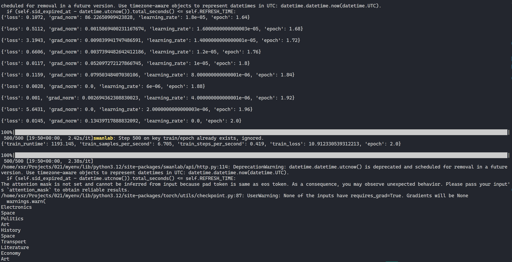
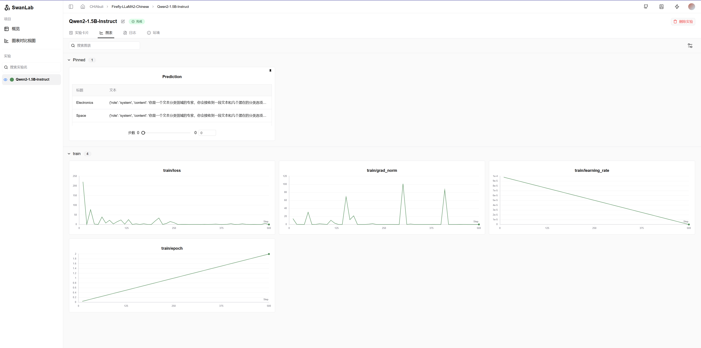
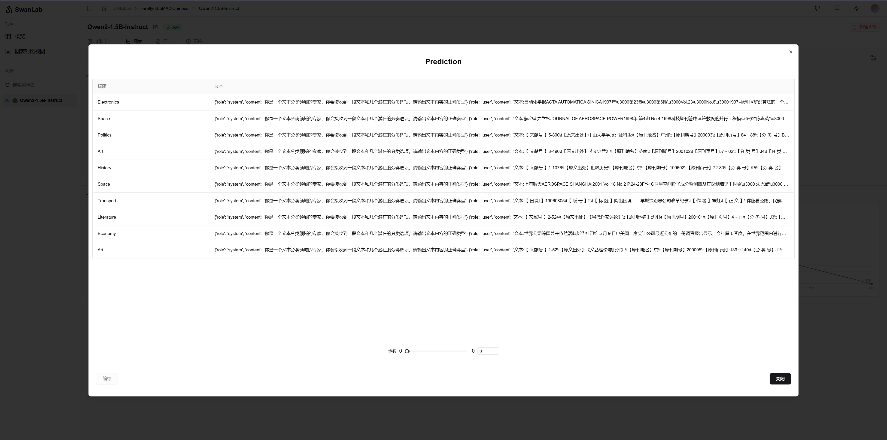

# Firefly-LLaMA2-Chinese

本文将介绍如何使用 **Qwen2-1.5b-Instruct** 模型在 **复旦中文新闻** 数据集上进行指令微调训练，并通过 **SwanLab** 监控训练过程及评估模型效果。

- **数据集**：zh_cls_fudan_news  
- **SwanLab**：[https://swanlab.cn](https://swanlab.cn)

## 什么是大模型指令微调（Instruction Tuning）？

大模型指令微调（Instruction Tuning）是一种针对大型预训练语言模型的微调方法，旨在提高模型在理解和执行特定自然语言指令方面的能力。通过该技术，模型能够根据用户提供的指令，生成准确、恰当的响应或执行任务。

指令微调的核心目标是增强模型对指令的遵循能力，使其在各类应用场景中具备更强的泛化能力和实用性。指令微调不仅提升模型的准确性和一致性，还使得模型在执行任务时更加灵活和智能，能处理各种任务和问题。

例如，在本案例中，我们将在中文新闻数据集上进行指令微调，使得模型能够根据新闻文本和类别信息（如“Sports”、“Politics”）预测出正确的类别。

## 1. 环境安装

本案例基于 **Python 3.12** 环境，所需依赖库包括：

- swanlab
- modelscope
- transformers
- datasets
- peft
- accelerate
- pandas

可以使用以下一键安装命令：

```bash
pip install swanlab modelscope transformers datasets accelerate peft pandas
```


## 2. 准备数据集

本案例使用的 **zh_cls_fudan_news** 数据集，主要用于文本分类模型的训练。该数据集包含几千条新闻数据，每条数据有三列：

- **text**：新闻文本内容
- **category**：新闻的多个备选类别
- **output**：新闻的真实类别（标签）

数据集链接：[zh_cls_fudan-news](https://www.modelscope.cn/datasets/swift/zh_cls_fudan-news)

你可以通过以下命令下载数据集：

```bash
git clone https://www.modelscope.cn/datasets/swift/zh_cls_fudan-news.git
```

### 数据集样例

```plaintext
[PROMPT]Text: 第四届全国大企业足球赛复赛结束新华社郑州５月３日电（实习生田兆运）上海大隆机器厂队昨天在洛阳进行的第四届牡丹杯全国大企业足球赛复赛中，以５：４力克成都冶金实验厂队，进入前四名。沪蓉之战，双方势均力敌，９０分钟不分胜负。最后，双方互射点球，沪队才以一球优势取胜。复赛的其它３场比赛，青海山川机床铸造厂队３：０击败东道主洛阳矿山机器厂队，青岛铸造机械厂队３：１战胜石家庄第一印染厂队，武汉肉联厂队１：０险胜天津市第二冶金机械厂队。在今天进行的决定九至十二名的两场比赛中，包钢无缝钢管厂队和河南平顶山矿务局一矿队分别击败河南平顶山锦纶帘子布厂队和江苏盐城无线电总厂队。４日将进行两场半决赛，由青海山川机床铸造厂队和青岛铸造机械厂队分别与武汉肉联厂队和上海大隆机器厂队交锋。本届比赛将于６日结束。（完）
Category: Sports, Politics
Output:[OUTPUT]Sports
```

在这个例子中，我们的目标是训练微调后的模型，能够根据给定的文本和类别信息，准确预测出对应的新闻类别。

## 3. 准备运行代码

在开始训练前，确保您的目录结构如下：

```
|--- train.py
|--- data
    |--- train.jsonl
    |--- test.jsonl
```

### 特别说明：

1. **train.py**：用于执行模型训练的主程序。
2. **train.jsonl**：训练数据，包含 **text** 和 **output** 信息。
3. **test.jsonl**：测试数据，用于评估微调后的模型效果。

请确保在运行之前，登录到 **SwanLab** 监控训练过程并进行效果评估。\
具体操作是将 **train.py** 中的"你的API令牌"进行修改

## 4. LLaMA2模型微调原理

LLaMA（Large Language Model Meta AI）是一种大型预训练语言模型，具有强大的文本生成、理解和推理能力。LLaMA2是LLaMA系列的更新版本，优化了模型架构和训练过程，提供了更好的性能和更高的灵活性。在指令微调任务中，LLaMA2的微调技术通过以下几个步骤进行优化：

1. **数据处理**：将训练数据转换成适合LLaMA2微调的格式（如文本和目标输出的对应关系）。
2. **任务适配**：在指令微调中，需要针对特定任务设计输入提示词（PROMPT）以及输出标准（OUTPUT）。LLaMA2可以通过与用户提供的自然语言指令进行映射，来执行特定任务。
3. **微调过程**：使用标注好的训练数据，在LLaMA2的预训练基础上进一步训练模型，以优化其对指令的响应能力。微调过程中，通过不断调整模型参数，使其能够更准确地处理和响应各种自然语言任务。
4. **评估与优化**：通过对验证集的测试，评估微调后的模型效果，并根据结果进一步调整模型参数，提高其在实际应用中的表现。

## 5. 训练与评估

### 运行结果截图

训练过程截图



训练过程的监控和评估通过 **SwanLab** 进行。以下为测试集上的训练结果截图：



测试集上的最终结果：



## 总结

通过对 **LLaMA2** 模型进行指令微调，我们可以有效地提高模型在理解和执行特定指令时的能力。在本案例中，通过微调，模型能够根据新闻文本和类别信息，准确预测新闻的分类，展示了指令微调在文本分类任务中的应用效果。使用 **SwanLab** 监控训练过程、评估模型效果，使得整个训练和优化流程更加高效和可控。

## 参考资料
[初学者如何对大模型进行微调？林泽毅的回答](https://www.zhihu.com/question/638803488/answer/3525197761)
